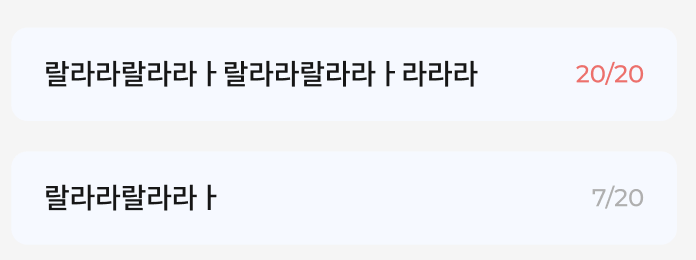

# HousUIComponent

**Component 생성시에 스크린샷 첨부하기 **

**사용법은 적어주면 좋음**


## Button

종류는 총 네가지
* 사용방법은 Sources/HousUIComponent/Button/Constant.swift 파일의 열거형을 확인하고 알맞는 옵션을 선택해서 사용
ex) ```BasicButton(.kakao)```

1. BasicButton


2. CheckButton
** Todo 추가/수정의 알림받기, 설정뷰의 생일정보 공개/비공개 체크버튼을 새로 발견했습니다. 빠른 시일 내에 구현해놓을게요


3. FilterButton


4. OnboardingButton


## TextField
1. RoundedFilledTextField




## Label

1. HousLabel
   * 생성시에 HousFont를 넣어주면 됨. Hous Font의 종류는 Figma에서 확인할 수 있음


